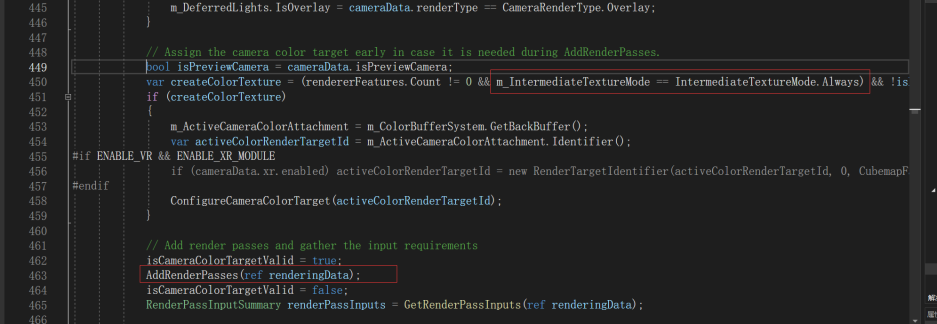
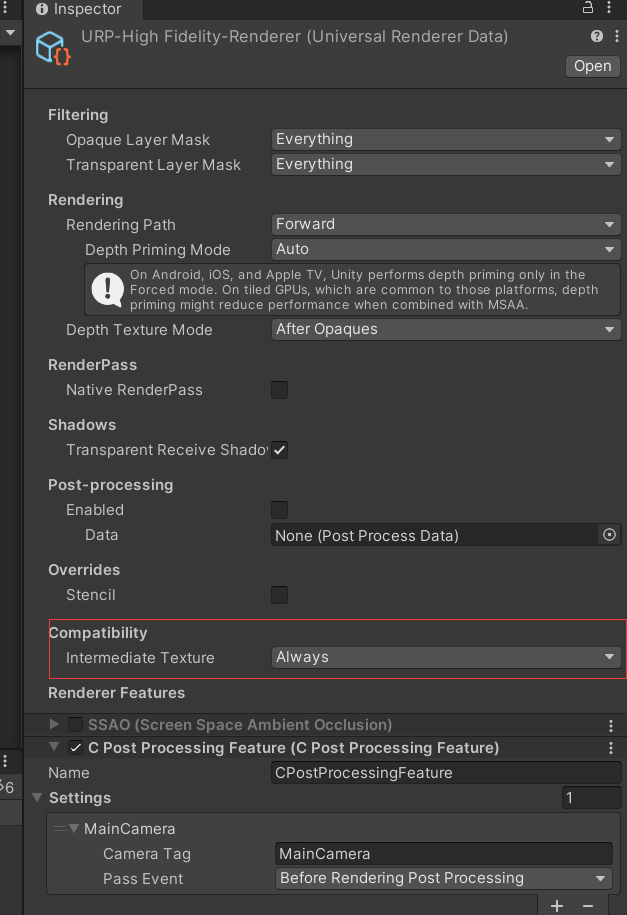

# unity的urp自定义ScriptableRendererFeature中CameraColorTarget实例是空的问题

关于自定义ScriptableRendererFeature中，在AddRenderPasses中使用ScriptableRenderer.cameraColorTarget得到的RenderTarget实例是空的问题。是因为在AddRenderPass会根据环境条件才创建CameraColorTarget实例。然后这个条件主要是rendererFeatures的数量> 0,并且m_IntermediateTextureMode（中间贴图模式）的变量值必须是Always

然后可以在UniversalRendererData中开启它

